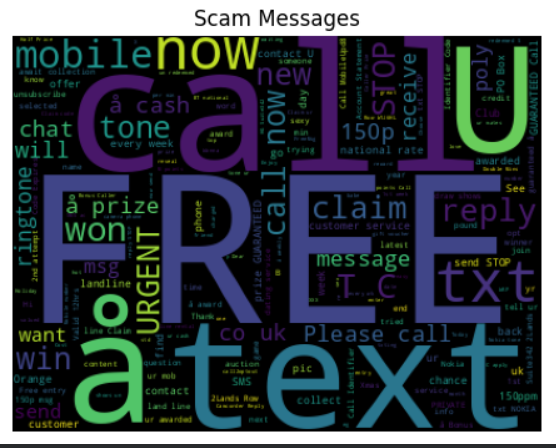
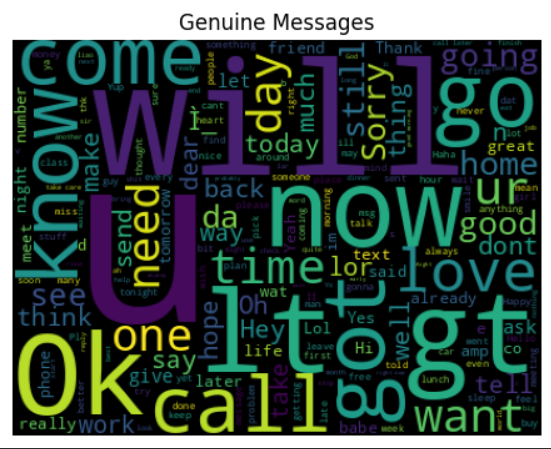
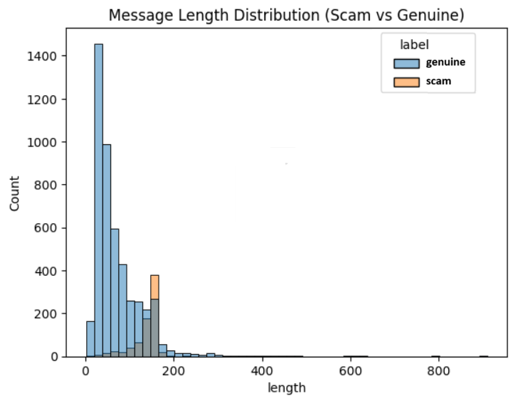

# 🛡️ CyberRakshak
### Gamified Cybersecurity Learning Platform

---

## 📌 Overview
**CyberRakshak** is an interactive, gamified cybersecurity awareness platform designed to educate users about online threats such as phishing, OTP fraud, and social engineering attacks.

The platform integrates a **Scam Detection Model** with gamified learning to provide both **awareness and real-time threat understanding**, making cybersecurity education practical and engaging.

---

## 🎯 Problem Statement
With the rapid growth of digital services, cybercrime cases are increasing due to lack of awareness and digital literacy.

Common threats include:
- Phishing attacks  
- OTP fraud  
- Fake loan scams  
- Social engineering  

Existing solutions:
- Do not provide real-time detection understanding  
- Lack interactive learning  
- Are not beginner-friendly  

---

## 💡 Proposed Solution
CyberRakshak provides a **gamified cybersecurity learning platform integrated with a Scam Detection Model**, where users:

- Learn through real-life cyber attack simulations  
- Analyze scam messages using AI  
- Participate in quizzes and challenges  
- Earn rewards and badges  

---

## 🚀 Key Features

### 🔐 Phishing Detection Simulator
- Simulated emails and SMS  
- Identify fake links  
- Instant feedback  

### 📞 Scam Call Simulation
- Real-life fraud scenarios  
- Decision-based learning  

### 🔑 Password Strength Analyzer
- Checks password strength  
- Suggests improvements  

### 🧠 Scam Detection Model (Core Feature)
- AI/ML-based detection of scam messages  
- Classifies messages as **Scam / Genuine**  
- Uses NLP techniques for text analysis  
- Helps users understand how fraud detection works  

### 🌐 Multi-Language Support
- Hindi  
- English  
- Regional languages  

### 🏆 Gamification Engine
- Points and rewards  
- Leaderboard  
- Achievement badges  

---

## 🏗️ System Architecture

- **Frontend:** React.js / Flutter  
- **Backend:** Node.js / Django  
- **Database:** MongoDB / MySQL  
- **AI/ML Module:** Python (Scam Detection Model using NLP)

---

## 🧩 Tech Stack

| Layer        | Technology            |
|-------------|---------------------|
| Frontend     | React / Flutter      |
| Backend      | Node.js / Django     |
| Database     | MongoDB / MySQL      |
| AI/ML        | Python, NLP, Scikit-learn |
| Hosting      | AWS / Firebase       |

---

## 🤖 Scam Detection Model Details

The Scam Detection Model is a key component of CyberRakshak.

### 🔍 Functionality

* Takes user input (SMS / Email text)
* Processes text using Natural Language Processing (NLP)
* Detects suspicious communication patterns
* Classifies messages as:

  * Scam
  * Genuine

### ⚙️ Techniques Used

* Text preprocessing
* Tokenization
* Transformer-based NLP
* DistilBERT Fine-Tuning
* Binary Text Classification

### 🧪 Model Validation

The model was evaluated using a curated validation dataset containing both legitimate and scam-related messages.

#### Categories Tested

* OTP Fraud
* Lottery Scams
* Banking Verification Scams
* Password Reset Phishing
* Promotional Reward Scams
* Utility Notifications
* General Communication Messages

#### Security Testing Findings

##### Successfully Detected

* Lottery scams
* Password reset scams
* Fake account verification requests
* Promotional reward scams

##### False Positive Cases

* Utility billing notifications occasionally flagged as suspicious

##### False Negative Cases

* Certain OTP-based scam messages were not detected

#### Security Assessment

The model demonstrates strong capability in identifying common phishing and social engineering attacks. Additional training data containing OTP fraud patterns and legitimate service notifications can further improve robustness.

### 📊 Cybersecurity Testing Artifacts

The project includes:

* Validation Dataset
* Validation Results
* False Positive Analysis
* False Negative Analysis
* Performance Metrics
* Test Execution Report
* Security Improvement Recommendations

---

## 👨‍💻 Team Structure

| Name | Role | Responsibility |
|------|------|---------------|
| Deepanshu Singh (Team Leader) | Cybersecurity & Full Stack Developer | Project coordination, frontend-backend development, basic cybersecurity implementation, integration of all modules |
| Ayush Kumar (Associate Lead) | AI/ML Engineer & System Developer | Scam Detection Model (NLP + ML), data processing, backend logic, overall system functionality |
| Kriti Dwivedi | Cybersecurity |  Attack simulation, threat analysis, designing real-world cyber attack scenarios |
---

## 📊 Use Cases
- Cyber awareness in rural areas  
- School cybersecurity education  
- Training for new internet users  
- Digital literacy programs  

---

## 📈 Expected Outcomes
- Increased cybersecurity awareness  
- Reduced cyber fraud cases  
- Understanding of AI-based scam detection  

---

## 🔮 Future Scope
- Deep learning-based detection models  
- Real-time browser phishing detection  
- Integration with cybercrime reporting systems  
- Mobile application  

---

## 📸 Screenshots

<h3 align="center">Word Clouds</h3>

<table>
  <tr>
    <td align="center">
      
    </td>
    <td align="center">
      
    </td>
  </tr>
</table>

<h3>Likelihood based on message size </h3>


## 🎥 Project Video
_Add project video link here_

---

## ⚙️ Installation

```bash
git clone https://github.com/Deep-2003/CyberRakshak-Gamified-Cybersecurity-Learning-Platform.git
cd CyberRakshak-Gamified-Cybersecurity-Learning-Platform
npm install
npm start
